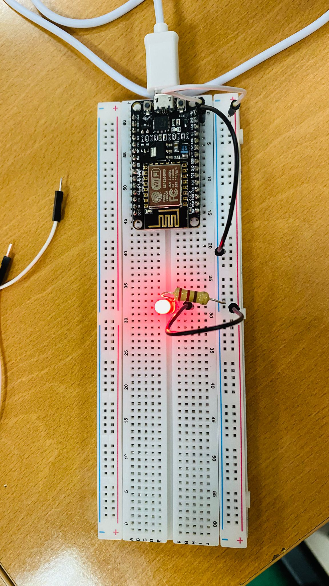
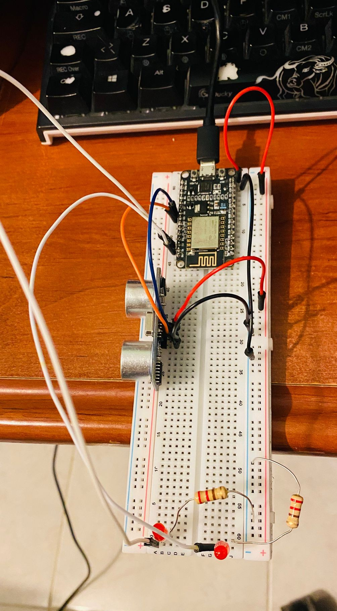
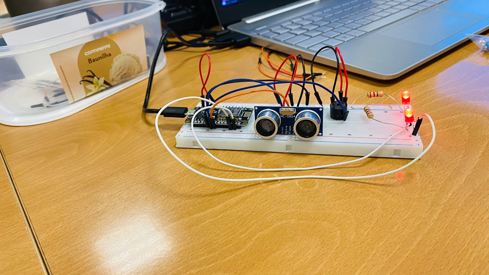
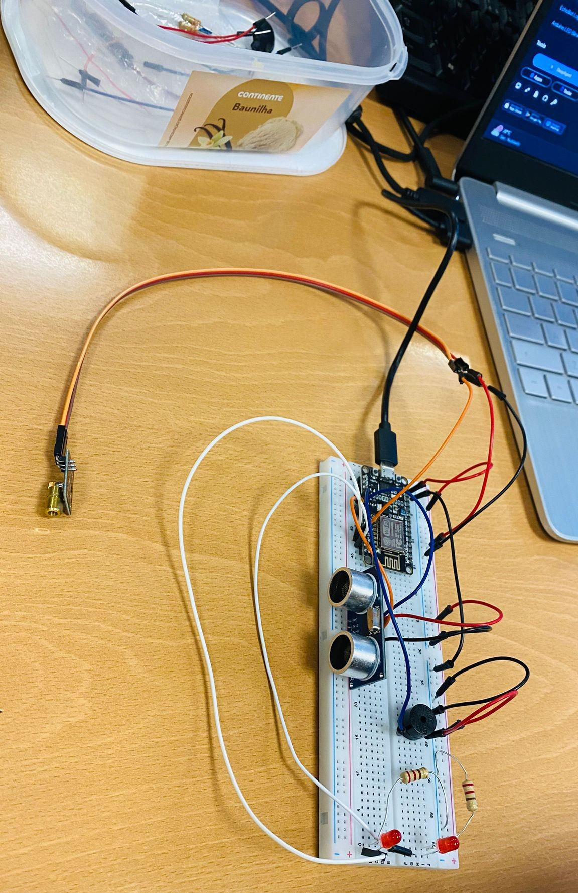

# Projeto EchoBot: ESP8266 + HC-SR04 + Buzzer + 2 LEDs + Laser

## Visão Geral do Projeto

O EchoBot é um mini robot para deteção de movimento baseado no microcontrolador ESP8266. Utiliza um sensor ultrassónico HC-SR04 para medir a distância a objetos. Quando um obstáculo se aproxima a menos de 35 cm (aqui 35 cm, mas facilmente se modifica), o EchoBot entra em modo ataque e ativa 2 LEDs vermelhos, um buzzer que emite som e ativa um laser, de modo a "intimidar" quem se aproxima.

Este projeto é ideal para aprender sobre sensores ultrassónicos, controlo de periféricos (LEDs, buzzer, laser) e programação de microcontroladores com ESP8266.

## Imagens do Projeto

### Logo do Projeto

### Teste 1-2

### Teste 3

### Teste 4

### Teste 5

## Funcionalidades

*   **Deteção de Proximidade:** Mede a distância a obstáculos usando o sensor HC-SR04. Quando o obstáculo está próximo ativa o sistema.
*   **Feedback Visual:**
    *   Dois LEDs vermelhos acendem.
    *   Um módulo laser é ativado.
*   **Feedback Sonoro:** O buzzer emite sons intermitentes.
*   **Leitura Estabilizada:** SUGESTÃO DA AI - Implementa suavização (smoothing) das leituras do sensor para maior precisão e estabilidade.
*   **Comunicação Série:** Envia dados de distância e estado dos componentes para o serial monitor para monitorização e feedback ao utilizador.

## Componentes Necessários

Para replicar este projeto, são necessários os seguintes componentes:

*   **Microcontrolador:** ESP8266 (ex: NodeMCU ESP-12E)
*   **Sensor de Distância:** HC-SR04 (Sensor Ultrassónico)
*   **Indicadores Visuais:**
    *   2x LEDs (qualquer cor, preferência do utilizador)
    *   2 Resistências de 220 Ohm (usar: https://www.calculator.net/resistor-calculator.html)
    *   1x Laser
*   **Indicador Sonoro:** 1x Buzzer Ativo
*   **Cabos:** 15-20 Cabos (macho-macho, macho-fêmea)
*   **Breadboard:** Para montar o circuito
*   **Software:** Arduino IDE com suporte para ESP8266

## Esquema de Ligação (Fritzing / Diagrama)

Ver relatório do trabalho (Capítulo da Arquitetura do Projeto).

## Configurar e Carregar o Código

1.  **Instalar o Arduino IDE:** Disponível em: (https://www.arduino.cc/en/software)
2.  **Adicionar o Suporte para ESP8266:**
    *   No Arduino IDE, `Ficheiro > Preferências`.
    *   No campo "URLs Adicionais para Gestor de Placas", adicionar:
        `http://arduino.esp8266.com/stable/package_esp8266com_index.json`
    *   Ir a `Ferramentas > Placa > Gestor de Placas...`
    *   Procurar por "esp8266" e instalar o pacote "esp8266 by ESP8266 Community".
3.  **Selecionar a Placa:**
    *   Ir a `Ferramentas > Placa > ESP8266 Boards` e selecionar a placa (ex: "NodeMCU 1.0 (ESP-12E Module)").
    *   Selecionar a porta COM correta em `Ferramentas > Porta`.
4.  **Caso não funcionem os passos anteriores** Disponível em: (https://randomnerdtutorials.com/install-esp32-esp8266-usb-drivers-cp210x-windows/)
    *   Instalar um driver específico para o windows reconhecer o ESP8266 (https://www.silabs.com/software-and-tools/usb-to-uart-bridge-vcp-drivers)
    *   Ir ao Gestor de Dispositivos
    *   Portas COM - CP210, se não estiver ativo fazer "Atualizar o controlador", escolher a pasta do CP210 e vai funcionar.
5.  **Copiar o Código:** Copia o código `EchoBot.ino` para o Arduino IDE.
6.  **Carregar o Código:** Clica no botão "Carregar" (seta para a direita) no Arduino IDE. Certificar que o ESP8266 está ligado ao computador via USB.

## Parâmetros Configuráveis no Código

Ajustar os seguintes parâmetros para personalizar o comportamento do EchoBot:

*   `threshold_cm`: A distância em centímetros que ativa os LEDs, buzzer e laser. (Padrão: `35.0`)
*   `samples`: O número de leituras do sensor a usar para calcular a média (suavização). (Padrão: `5`)
*   `settle_ms`: O tempo de espera em milissegundos entre cada amostra de leitura do sensor. (Padrão: `50`)
*   `buzzerFreq`: A frequência do som do buzzer em Hz. (Padrão: `2000`)
*   `buzzerDuration`: A duração de cada "beep" do buzzer em milissegundos. (Padrão: `100`)
*   `buzzerPause`: A duração da pausa entre "beeps" em milissegundos. (Padrão: `100`)

##  troubleshooting

*   **" Nada a fazer , estudasses ... " no Monitor Série:**
    *   Verificar as ligações do HC-SR04 (VCC, GND, Trig, Echo).
    *   Ver se há um objeto dentro do alcance do sensor (2cm a 2m).
    *   Verificar se o sensor está a apontar para uma superfície que reflete o som.
    *   Se o objeto estiver a menos de 2cm vai mostrar a mensagem.
*   **LEDs/Buzzer/Laser não funcionam:**
    *   Verificar as ligações dos componentes aos pinos corretos do ESP8266.
    *   Confirmar que os LEDs têm resistências individuais.
    *   Verificar se temos um buzzer ativo.
    *   Verifica se a distância do objeto está abaixo do `threshold_cm`.
*   **Problemas ao carregar o código:**
    *   Verificar se a placa está corretamente selecionada.

**Desenvolvido com ajuda de AI - Projeto para a UC de Sistemas Embebidos - Licenciatura em Engenharia Informática - 3º ano**
